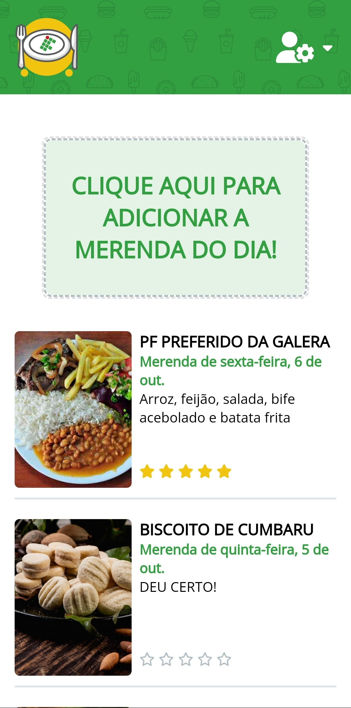

# ai-que-fome-showcase

## Sumário

- [ai-que-fome-showcase](#ai-que-fome-showcase)
  - [Sumário](#sumário)
  - [Motivação](#motivação)
    - [O problema](#o-problema)
    - [A solução](#a-solução)
    - [Times](#times)
    - [URLs](#urls)
  - [Pilha de tecnologia](#pilha-de-tecnologia)
    - [API](#api)
    - [Módulos administrativo e discente](#módulos-administrativo-e-discente)
  - [Galeria](#galeria)
    - [Módulo administrativo](#módulo-administrativo)
    - [Módulo discente](#módulo-discente)

## Motivação

### O problema

Após a atividade sobre internacionalização do Fotorama, o [Prof. Sidney](https://github.com/sidneyroberto) decidiu usar esta unidade curricular para atacar uma demanda presente no IFMS câmpus Aquidauana relacionada à oferta de refeições nos intervalos entre as aulas.

No momento, não há nenhum tipo de pesquisa de satisfação acerca das refeições cujo público-alvo seja os discentes. Isto posto, a equipe responsável não tem feedback e a decisão de quais refeições preparar para os três turnos do dia acaba sendo arbitrária, podendo ou não ser do desagrado dos discentes. Além disso, o discente só descobre qual refeição está sendo ofertada no dia quando chega ao começo da extensa fila, pois não há nenhum tipo de cardápio em quaisquer quadros de aviso do câmpus.

### A solução

A solução para este problema, proposta pelo Prof. Sidney e executada pelo 5º período do Curso Superior de Tecnologia em Sistemas para Internet (30715), foi a criação de um aplicativo em que os discentes possam visualizar qual refeição está sendo ofertada no dia e avaliá-la com um número inteiro de um a cinco (_star rating_) e um comentário opcional; e a criação de um aplicativo para que a equipe responsável cadastre as refeições no começo do dia. Obviamente, também foi desenvolvida uma API cujos serviços de consulta são consumidos por ambos os aplicativos.

A turma se dividiu em dois times para a execução das tarefas, simulando a experiência real de desenvolver software em uma empresa:

### Times

| Time | Colaborador | GitHub |
|-|-|-|
| Back-end | Rafael Castro | [RafaelCastro1002](https://github.com/RafaelCastro1002) |
| Back-end | Nathan Gauna | [NathanAlv](https://github.com/NathanAlv) |
| Back-end | Ryan Neto | [RyanMatheusNeto](https://github.com/RyanMatheusNeto) |
| Back-end | José Filho | [joseluizms](https://github.com/joseluizms) |
| Back-end | Murilo Souza | [MURILO17SILVA](https://github.com/MURILO17SILVA) |
| Front-end | Diego Fernandes | [DIEG0FERNANDES](https://github.com/DIEG0FERNANDES) |
| Front-end | Matheus Gomes | [mdccg](https://github.com/mdccg) |
| Front-end | Abílio Soares | [abilio-charles](https://github.com/abilio-charles) |
| Front-end | Paulo Ribeiro | [Paulodanielribeiro](https://github.com/Paulodanielribeiro) |
| Front-end | Márcio Lipu | [Usuariodogithub](https://github.com/Usuariodogithub) |

Cada time tinha uma espécie de Scrum Master cuja função era delegar tarefas aos demais colaboradores do time e ajudá-los, cobrindo a parte deles se necessário, para garantir a implementação do _backlog_ até o final da _sprint_ em questão. O Scrum Master do time do back-end foi o Rafael Castro, ao passo que os Scrum Masters (foi necessário dois devido à ausência de _skill-based matchmaking_[1](#nota-de-rodape-1) no time) fomos Matheus Comparoto e eu. É digno de nota que, devido à dificuldade do time do front-end em finalizar o módulo administrativo, o próprio Prof. Sidney desenvolveu o módulo discente para agilizar a entrega do produto final.

O projeto teve início na sexta-feira do dia 25 de agosto e o Produto Mínimo Viável foi finalizado na sexta-feira do dia 6 de outubro. Em outras palavras, ele durou exatamente três _sprints_, cada _sprint_ com duração de quatorze dias. Em breve, ele entrará em produção e os discentes do IFMS câmpus Aquidauana poderão avaliar as refeições ofertadas nos intervalos entre as aulas.

### URLs

| Ambiente | Módulo | Link |
|-|-|-|
| Teste | Discente | https://ai-que-fome-test.vercel.app |
| Teste | Administrativo | https://ai-que-fome-admin-teste.vercel.app |
| Teste | API | https://app-merenda-api-test.vercel.app |
| Produção | Discente | https://ai-que-fome.vercel.app |
| Produção | Administrativo | https://ai-que-fome-admin.vercel.app |
| Produção | API | https://app-merenda-api-new.vercel.app |

Os repositórios de código apresentados no Curso Superior de TSI do IFMS como requisito para obtenção da nota parcial das atividades da unidade curricular Linguagem de Programação IV estão privados. Entretanto, este é o _terceiro_ repositório de código _público_ da unidade curricular cujo intuito é manter a lista de repositórios de código ordenada.

1 _Skill-based matchmaking_ é um sistema usado para combinar jogadores com outros jogadores de nível de habilidade semelhante em jogos multijogador em plataformas de jogos on-line. Neste parágrafo, eu quis dizer que todos os outros colaboradores do time eram menos experientes ou novatos. Em empresas, é comum haver um número máximo de Desenvolvedores Jr. e cada Desenvolvedor Jr. deve ser apadrinhado por um Desenvolvedor Sênior. Infelizmente, não foi o caso deste projeto. Observação: Este não é um termo comumente usado no ramo da computação, mas foi o único que encontrei para comunicar o problema com concisão.

## Pilha de tecnologia

### API

| Papel | Tecnologia |
|-|-|
| Framework | [Express](https://expressjs.com/pt-br/) |
| Autenticação via provedor | [Firebase](https://firebase.google.com/?hl=pt) |
| Armazenamento de imagens | [Firebase](https://firebase.google.com/?hl=pt) |
| Mensageria | [Firebase](https://firebase.google.com/?hl=pt) |
| Hospedagem do banco de dados | [MongoDB Atlas](https://www.mongodb.com/atlas/database) |
| Ferramenta de TDD | [Postman](https://www.postman.com/) |
| Documentação | [Swagger UI](https://swagger.io/) |
| Hospedagem da API | [Vercel](https://vercel.com/) |

### Módulos administrativo e discente

| Papel | Tecnologia |
|-|-|
| Biblioteca de desenvolvimento | [React](https://react.dev/) |
| Bundler | [create-react-app](https://create-react-app.dev/) |
| Biblioteca de interface de usuário | [Material Design](https://mui.com/) |
| Hospedagem | [Vercel](https://vercel.com/) |

Os créditos pelas mídias utilizadas estão disponíveis nos repositórios privados do projeto. 

## Galeria

### Módulo administrativo

### Módulo discente

